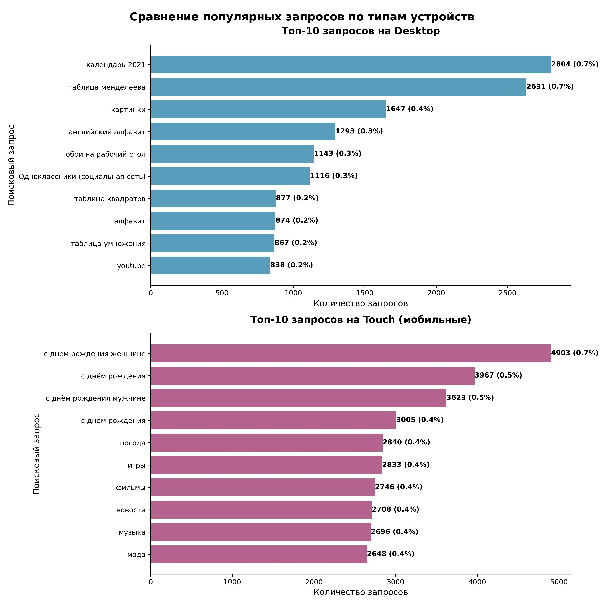
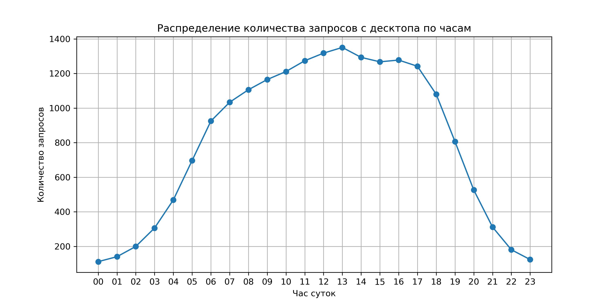
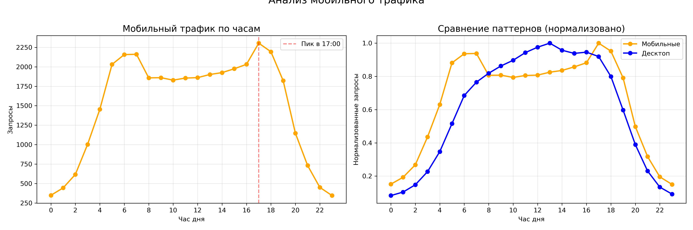

Данный проект выполнен в рамках тестового задания для Яндекс.Крауд.  
**Цель исследования:** Проверить гипотезу о том, что интересы пользователей, 
выполняющих поиск по картинкам на мобильных устройствах и компьютерах, существенно различаются.

Для этого был предоставлен семл с запросами к Яндекс.Картинкам. В ходе анализа решались задачи по определению временных рамок данных, сравнению популярности конкретных запросов и целых тематик, а также изучалось распределение трафика в течение дня.

**Jupyter Notebook**:
[Notebook с решениями](https://github.com/vncvtkv/Yandex_Product_Analytic_test/blob/main/yandex_test.ipynb)

При формировании датафреймов использовал SQLite.
# Условия задач

## Задача 1: Укажите даты диапазона, предоставленного вам для анализа.
**Краткий итог**: 
- Период с 2021-08-31 00:00:00 по 2021-09-21 00:00:00
- Всего затронуто календарных дней: 22
- Особенности выборки:
  • Первый день неполный: первая запись в 2021-08-31 21:00:00
  • Последний день неполный: последняя запись в 2021-09-21 20:59:59
## Задача 2:  Рассчитайте кол-во запросов с текстом "ютуб" в каждой платформе (desktop, touch).
**Краткий итог**: 
| platform  | count | 
|-------|-----|
| desktop | 1651  | 
| touch   | 756  | 

При построении выборки используем функцию LOWER для регистронезависимости, также выбираем запросы на разных языках.
Первоначальный анализ показывает, что на desckop запрос youtube ищут больше в 2.18 раза.
Т.к. в запросах могут быть опечатки, то для более подробного анализа можно воспользоваться нечетким поиском - fuzzy search.

## Задача 3:  Выведите топ-10 самых частотных запросов в каждой платформе. Какие отличия вы видите?

- Наблюдение:
1) Топ-10 запросов на десктопе и мобильных устройствах не пересекаются. 
На десктопе доминируют запросы, связанные с образованием (таблицы, алфавиты) 
и утилитами (календарь, обои). На смартфонах — социальные запросы 
(поздравления с днём рождения), развлечения (игры, музыка, фильмы) 
и повседневные сервисы (погода, новости, мода).
2) За рассматриваемый промежуток времени, количество запросов с мобильных устройств в два раза больше, чем с десктопа.

- Гипотеза:
Можно предположить, что десктопом пользуются меньше и в более прикладных целях, тогда как мобильное устройство более
распространено и используется, в основном, для развлечения и социальных взаимодействий.
Предположительно, запросы c устройств можно сгруппировать в тематические кластеры, 
которые могут служить маркерами для определения типа пользовательского 
устройства. Если кластеризация подтвердится, это будет означать, что 
поведение пользователей (их информационные потребности) системно различается 
в зависимости от платформы.
## Задача 4:  Посмотрите, чем отличается трафик запросов в течение дня. Как можно объяснить отличие?

Обратимя к запросам с десктопа. Хотя строгий тест Шапиро-Уилка (p=0.0025) формально указывает на отклонение от идеального нормального распределения, для бизнес-анализа распределение можно считать практически нормальным. Основные характеристики:

Форма: четкий колоколообразный паттерн с плавным подъемом и спадом

Пик: 13:00-14:00 (≈1300-1350 запросов)

Симметрия: значения равномерно распределены вокруг среднего (809 ± 457)

Такое распределение типично для пользовательской активности и хорошо поддается прогнозированию.

В отличие от десктопов, мобильный трафик демонстрирует:
- Два пика активности: утренний (06:00-08:00) и вечерний (17:00-18:00) - 2300 запросов
- Высокую активность в нерабочее время: значительный трафик в 22:00-05:00 (в 4-5 раз выше десктопного)
- Бимодальное распределение: два горба вместо одного колокола
- Положительную асимметрию (0.56) - затянутый "хвост" вечерней активности
- Это типичный паттерн для мобильных устройств: использование в транспорте, в перерывах и вечером дома.

Распределение существенно отличается от нормального и от десктопного паттерна. 
Также заметим, что с 8 до 16 часов наблюдается зеркальная динамика - падение трафика на мобильных стройствах совпадает с ростом трафика на десктопе.
Можно предположить, что проиходит смена устройств в течении дня:
- Утро (06:00-09:00) — пользователи заходят с мобильных устройств (в транспорте, перед работой)
- Рабочий день (09:00-18:00) — переход на десктопы (на рабочих местах)
- Вечер (после 18:00) — возврат к мобильным устройствам (дома, в дороге)
## Задача 5:  Выделите тематики запросов, контрастные для мобильных и компьютеров (темы, доля которых отличается на разных платформах).

